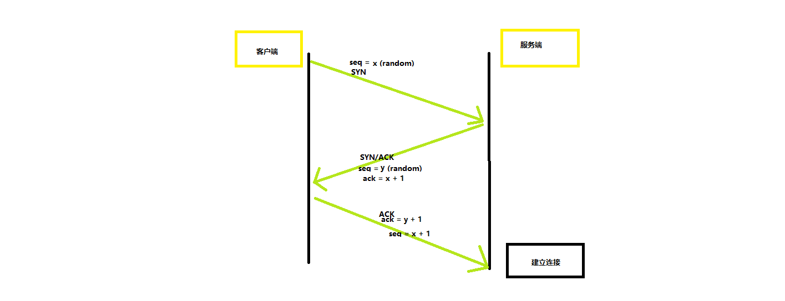

# [TCP](https://zh.wikipedia.org/wiki/%E4%BC%A0%E8%BE%93%E6%8E%A7%E5%88%B6%E5%8D%8F%E8%AE%AE)参考 wiki。

> 传输控制协议（英语：Transmission Control Protocol，缩写：TCP）是一种面向连接的、可靠的、基于字节流的传输层通信协议，由 IETF 的 RFC [793](https://tools.ietf.org/html/rfc793) 定义。在简化的计算机网络 OSI 模型中，它完成第四层传输层所指定的功能。用户数据报协议（UDP）是同一层内另一个重要的传输协议。

## 概述(wiki)

> 在因特网协议族（Internet protocol suite）中，TCP 层是位于 IP 层之上，应用层之下的中间层。不同主机的应用层之间经常需要可靠的、像管道一样的连接，但是 IP 层不提供这样的流机制，而是提供不可靠的包交换。

> 应用层向 TCP 层发送用于网间传输的、用 8 位字节表示的数据流，然后 TCP 把数据流分割成适当长度的报文段（通常受该计算机连接的网络的数据链路层的最大传输单元（MTU）的限制）。之后 TCP 把结果包传给 IP 层，由它来透过网络将包传送给接收端实体的 TCP 层。TCP 为了保证不发生丢包，就给每个包一个序号，同时序号也保证了传送到接收端实体的包的按序接收。然后接收端实体对已成功收到的包发回一个相应的确认信息（ACK）；如果发送端实体在合理的往返时延（RTT）内未收到确认，那么对应的数据包就被假设为已丢失并进行重传。TCP 用一个校验和函数来检验数据是否有错误，在发送和接收时都要计算校验和。

## 简介

-   Stream 数据流（tcp 层将数据称为流）
-   Segment 数据分组（段）

## 运作方式

### 创建连接(三次握手)

1. 客户端（通过执行 connect 函数）向服务器端发送一个 SYN 包，请求一个主动打开。该包携带客户端为这个连接请求而设定的随机数 X 作为消息序列号。
2. 服务器端收到一个合法的 SYN 包后，把该包放入 SYN 队列中；回送一个 SYN/ACK。ACK 的确认码应为 X+1，SYN/ACK 包本身携带一个随机产生的序号 Y。
3. 客户端收到 SYN/ACK 包后，发送一个 ACK 包，该包的序号被设定为 X+1，而 ACK 的确认码则为 Y+1。然后客户端的 connect 函数成功返回。当服务器端收到这个 ACK 包的时候，把请求帧从 SYN 队列中移出，放至 ACCEPT 队列中；这时 accept 函数如果处于阻塞状态，可以被唤醒，从 ACCEPT 队列中取出 ACK 包，重新创建一个新的用于双向通信的 sockfd，并返回。
    > 注意，如果在执行第 2 步时，客户端掉线了，服务端没有收到客户端传来的 ACK 包,那么连接处于中间状态，一定时间内，服务端会重发 SYN-ACK 包。liunx 下，默认为 5 次，重试间隔每次翻倍，第一次 1s，第 5 次重发结束后，等待 32 秒，便会关闭 tcp 连接。

### 数据传送

-   可靠传输:

    > 通常，每个 TCP 报文段种都存在一对序号和确认号。
    >
    > TCP 报文发送者称自己的字节流的编号为序号（sequence number），称接收到对方的字节流编号为确认号(ack)。
    >
    > TCP 报文接受到一定数量的连续字节流之后，会发送确认，成为选择确认。选择确认可以对乱序到达的数据块进行确认，序号每次都增加与确认数据相同的字节数(每一个字节，序号都会加 1)。
    >
    > 可靠性通过发送方检测丢失的传输数据并重传这些数据，包括超时重传，重复累计确认。

-   重复累计确认
    > 当发生丢失包的时候，假设丢失的包序号为 100,接收方就不能确认这个包以及之后的包，当收到 100 以后的包时，发出对 99 序号包的确认，当发送方收到 3 次对同一个包的确认，就重传最后一个未被确认的包。阈值设为 3 被证实可以减少乱序包导致的无作用的重传（spurious retransmission）现象。 选择性确认(SACK)的使用能明确反馈哪个包收到了，极大改善了 TCP 重传必要的包的能力。
-   超时重传
    > 发送发使用一个保守估计时间作为数据包确认的超时上限，当超过这个上限时就重传这个数据包，每当发送方收到确认包时，就重置这个定时器。如果重传定时器被触发，仍然没有收到确认包，定时器的值将被设置为前一次的 2 倍（直到阈值）。
-   最大分段大小 MSS
    > 单个分段中 tcp 愿意接受的数据的字节数大小。MSS 应当足够小以用来避免[IP 分片](https://zh.wikipedia.org/wiki/IP%E5%88%86%E7%89%87)，它会导致丢包或者过多的重传。在 tcp 建立连接时，双端在 SYN 报文中用 MSS 选项宣布各自的 MSS，这是其各自相连的数据链路层的最大传输单元（MTU）尺寸减去固定的 ip 头部和 tcp 首部长度。以太网 MTU 为 1500 字节，MSS 值可达 1460。使用 IEEE 802.3 的 MTU 为 1492 字节，MSS 可达 1452 字节。如果目的 IP 地址为“非本地的”，MSS 通常的默认值为 536（这个默认值允许 20 字节的 IP 首部和 20 字节的 TCP 首部以适合 576 字节 IP 数据报）。此外，发送方可用传输路径 MTU 发现（[RFC 1191](https://datatracker.ietf.org/doc/html/rfc1191)）推导出从发送方到接收方的网络路径上的最小 MTU，以此动态调整 MSS 以避免网络 IP 分片。
-   数据传输举例(1000 好算)
    -   发送发首先发送第一个包含序列号为 1(可变)的和 1000 字节的数据的 tcp 报文段给对方。接收方以一个没有数据的 tcp 报文段来回复（只存在报头），用确认号 1001 来表示已经完全收到并请求下一个报文段。
    -   发送方发送第二个包含序列号为 1001，长度为 1000 字节的数据的 tcp 报文段给接收方。正常情况下，接收方以一个没有数据的 tcp 报文段来回复，用确认号 2001 来表示已完全收到并请求发送下一个报文段，发送接收这样继续。
    -   当数据都是相连的时候，接收方没有必要每一次都去回去，收到 1-5 条报文段，只需要回复第 5 条就够了。
        > 我们例子中第 3 条报文段丢失，尽管接收方收到了第 4 条第 5 条，也不能确认第四和第 5 条，只能重复确认第 2 条。
    -   发送发在发送第三条之后，没能收到回应，当时钟过期时（重复累计确认次数也只有 2 次），他重发第 3 条（每次当发送方发送一条 tcp 报文段后，都会再次启动一次时钟，RTT），
    -   这次第三条被成功接受，接收方直接确认第 5 条。
-   校验和

    > TCP 校验和（Checksum）是一个端到端的校验和，由发送端计算，然后由接收端验证。其目的是为了发现 TCP 首部和数据在发送端到接收端之间发生的任何改动。如果接收方检测到校验和有差错，则 TCP 段会被直接丢弃。

    > TCP 校验和也包括了 96 位的伪头部，其中有源地址、目的地址、协议以及 TCP 的长度。伪头部是为了增加 TCP 校验和的检错能力，如检查 TCP 报文是否收错了(目的 IP 地址)、传输层协议是否选对了(传输层协议号)等。。

-   流量控制
    > 流量控制用来避免主机分组发送得过快而使接收方来不及完全收下，一般由接收方通告给发送方进行调控。
-   拥塞控制
    > 拥塞控制是发送方根据网络的承载情况控制分组的发送量，以获取高性能又能避免拥塞崩溃（congestion collapse，网络性能下降几个数量级）。这在网络流之间产生近似最大最小公平分配。
-   选择确认
    > 允许接收方确认它成功收到的分组的不连续的块，以及基础 TCP 确认的成功收到最后连续字节序号。

### 关闭连接(四次挥手)

-   想要终结连接的一端，向对方发出 FIN
-   对方回复 ACK 表示确认，
-   因此，拆掉一侧的连接过程需要一对 FIN 和 ACK，分别由两侧端点发出。

    > 首先发出 FIN 的一侧，如果给对方的 FIN 响应了 ACK，就会超时等待 2\*MSL 时间，然后关闭连接。在等待时间内，本地端口不能被新的连接使用，避免存在延时的包与新的连接混淆。RFC793 定义了 MSL 为 2 分钟，Linux 设置成了 30s。参数 tcp_max_tw_buckets 控制并发的 TIME_WAIT 的数量，默认值是 180000，如果超限，那么，系统会把多的 TIME_WAIT 状态的连接给 destory 掉，然后在日志里打一个警告（如：time wait bucket table overflow）

    > 连接可以工作在 TCP 半开状态。即一侧关闭了连接，不再发送数据；但另一侧没有关闭连接，仍可以发送数据。已关闭的一侧仍然应接收数据，直至对侧也关闭了连接。
