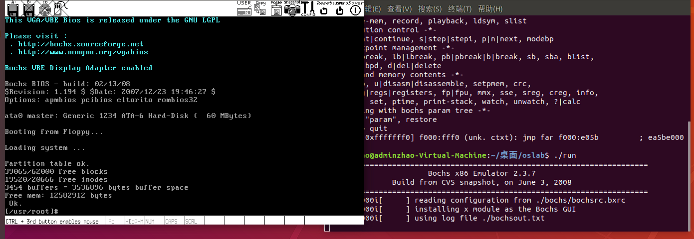
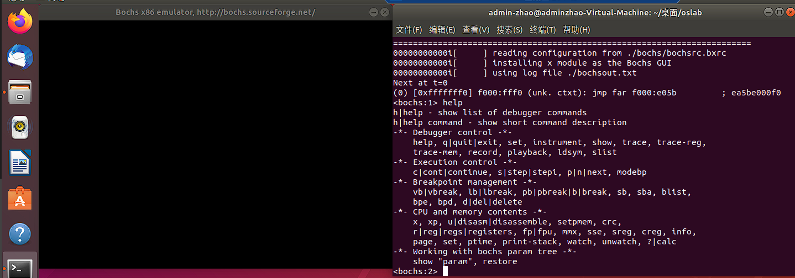
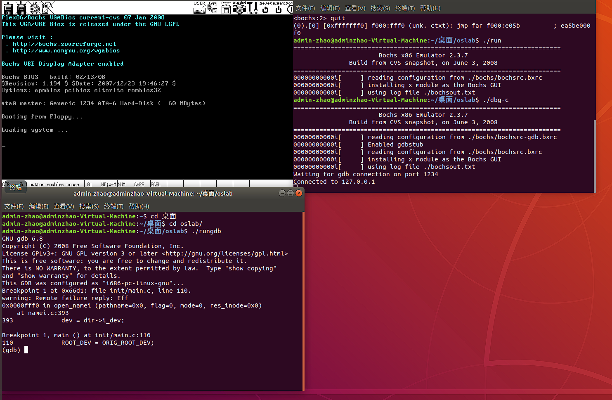
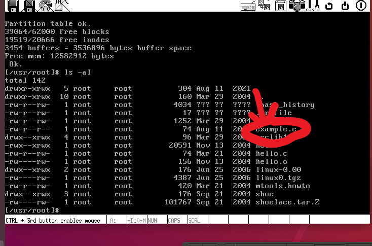

# 实验环境搭建

## 虚拟机

我使用的是 windows 自带的 hyper-v

## 操作系统

虚拟机安装的系统是 ubuntu-18.04.5-desktop-amd64.iso

实验是按照哈工大李治军老师的操作系统课程所需的环境搭建。

- Liunx 0.11
- Bochs
- gcc 3.4

一个有关实验内容的[仓库](https://github.com/DeathKing/hit-oslab),进去可以看到需要的一些环境。下载后运行脚本

```
    ./setup.sh
```

会自动安装一些实验所需的软件包。(我是一个个装的，淦)。

### hit-oslab

链接：https://pan.baidu.com/s/1KhIi_jZF-rWPGHDtiYp86A
提取码：wi27

### 问题

安装完成后，进入 oslab 目录下 make all 然后运行./run 会碰到一系列 error,我碰到的都是

```
 ./bochs/bochs-gdb: error while loading shared libraries: libSM.so.6: cannot open shared object file: No such file or directory
```

一类的问题，可以搜索对应库名称，通过 sudo apt-get install xxx:i386 安装相应包。 这里可以参考[这个文章](https://blog.csdn.net/qq_40758751/article/details/88707214)。

由此，安装环境完成。

## 实验步骤

### 准备环境，见上文。

- 解压完成，文件结构如下：

  - image 文件编译之后的目标文件（liunx 0.11
  - bochs 目录，与 bochs 相关的执行文件、数据文件和配置文件。
  - run 脚本

    运行 bochs 的脚本命令

    运行后 bochs 会自动在它的虚拟软驱 A 和虚拟硬盘上各挂载一个镜像文件，软驱上挂载是 linux-0.11/Image，硬盘上挂载的是 hdc-0.11.img。

    因为 bochs 配置文件中的设置是从软驱 A 启动，所以 Linux 0.11 会被自动加载。

    而 Linux 0.11 会驱动硬盘，并 mount 硬盘上的文件系统，也就是将 hdc-0.11.img 内镜像的文件系统挂载到 0.11 系统内的根目录 —— /。在 0.11 下访问文件系统，访问的就是 hdc-0.11.img 文件内虚拟的文件系统。

- hdc-0.11.img 文件

  hdc-0.11.img 文件的格式是 Minix 文件系统的镜像。

  Linux 所有版本都支持这种格式的文件系统，所以可以直接在宿主 Linux 上通过 mount 命令访问此文件内的文件，达到宿主系统和 bochs 内运行的 Linux 0.11 之间交换文件的效果。

  Windows 下目前没有（或者是还没发现）直接访问 Minix 文件系统的办法，所以要借助于 fdb.img，这是一个 1.44M 软盘的镜像文件，内部是 FAT12 文件系统。将它挂载到 bochs 的软驱 B，就可以在 0.11 中访问它。而通过 filedisk 或者 WinImage，可以在 Windows 下访问它内部的文件。

- hdc-0.11.img 内包含有：
  - Bash shell;
  - 一些基本的 linux 命令，工具，比如 cp,rm,mv,tar
  - vi
  - gcc 1.4
  - as86,id86
  - linux 0.11 源代码，可在 0.11 下编译，然后覆盖现有二进制内核。

### 编译内核

进入解压文件夹内后，

1. cd ./linux-0.11/
2. make all 多处理器下 make -j [num]

make 命令会自动跳过未被修改的文件，链接时直接使用上次编译生成的目标文件，从而节约编译时间。但如果重新编译后，你的修改貌似没有生效，可以试试先 make clean ，再 make all（或者一行命令：make clean && make all。make clean 是删除上一次编译生成的所有中间文件和目标文件，确保是在全新的状态下编译整个工程。

### 运行

1. cd ~/oslab/
2. ./run
   

### 汇编调试

运行前确定关闭之前 bochs

1. cd ~/oslab/
2. ./dbg-asm
   

### c 语言调试

1. cd ~/oslab/
2. ./dbg-c
3. 新打开终端
4. cd ~/oslab/
5. ./rungdb
   

### 文件系统 文件交互

> 开始交换文件之前，务必关闭所有 bochs 进程，容易损坏文件系统

1. cd ~/oslab/
2. sudo ./mount-hdc 启动挂载脚本(shiyanlou

3. 此时，hdc 目录就是和 0.11 内核一摸一样的文件系统了，可以读写任何文件(有些文件需要 sudo)

4. cd ~/oslab/hdc

此时可以使用 ls -al 查看内容，也可以在 Ubuntu 的 hdc 目录下创建一个文件，利用编辑工具编辑保存之后，执行卸载，在进入 linux 0.11 就会看到这个文件。（linux 0.11 只能 vi）

5. sudo umount hdc 卸载 hdc

   
